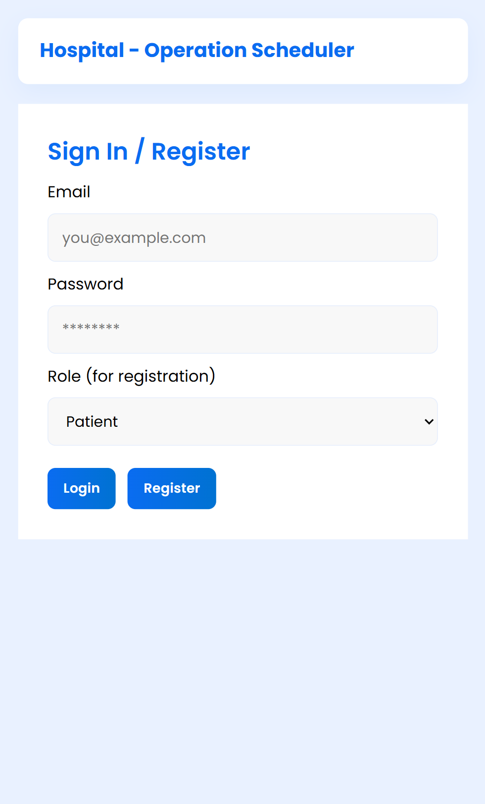

# Hospital Operation Scheduler

A web-based application to manage and schedule hospital operations efficiently using **HTML, CSS, JavaScript, and Firebase**.

## Features
- Firebase Authentication (Admin, Doctor, Patient roles)
- Role-based dashboards
- Add, edit, complete, and delete operations (Admin)
- View assigned operations (Doctor)
- Track operation status (Patient)
- Real-time data storage using Firestore
- Responsive and modern UI

## Tech Stack
- Frontend: HTML, CSS, JavaScript
- Backend: Firebase Authentication, Firestore
- Hosting: Firebase Hosting (optional)

## Project Structure
```
Hospital-Operation-Scheduler/
├── index.html  //Home page 
├── admin.html
├── doctor.html
├── patient.html
├── style.css
├── firebase.js
├── script.js
├── admin.js
├── doctor.js
├── patient.js
├── logger.js
├── README.md
```

## Screenshots

Screenshots of the app (located in the `screenshots/` folder):




## How to Run
1. Clone the repository
2. Configure Firebase project and add config to `firebase.js`
3. Open `index.html` using Live Server or browser

## Demo Credentials (Example)
- Admin: admin@gmail.com / 12345678
- Doctor: doctor@gmail.com / 12345678
- Patient: patient@gmail.com / 12345678

## Future Enhancements
- OT clash detection
- Notifications
- Analytics dashboard
- Mobile app integration
